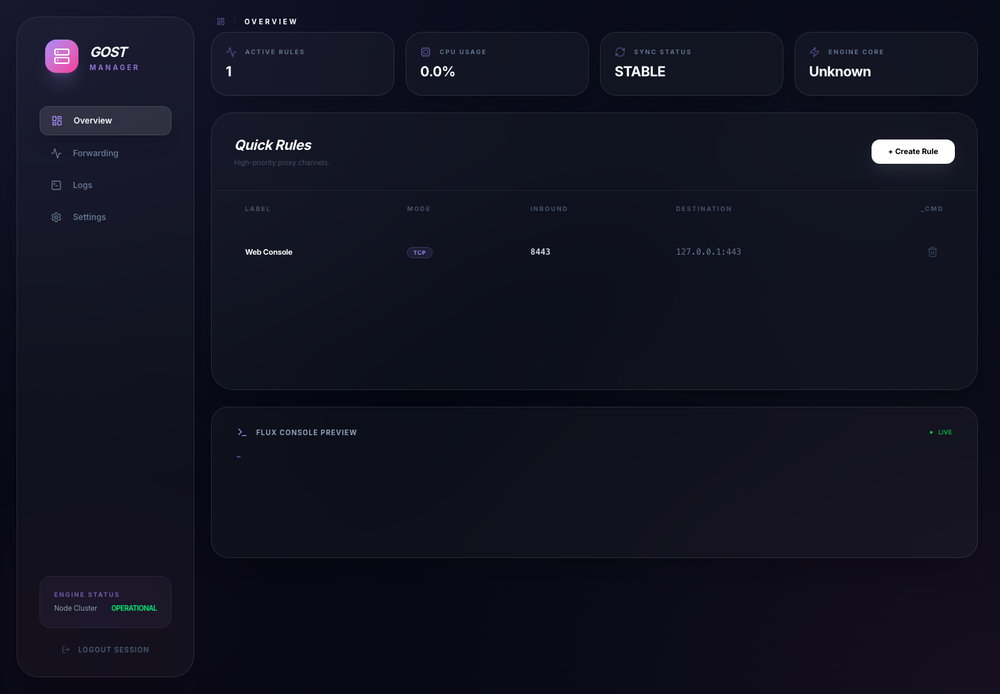

# GOST Manager 🚀

[](https://golang.org/)
[](https://react.dev/)
[](https://tailwindcss.com/)
[](https://www.docker.com/)

**GOST Manager** is a modern, high-end web control panel designed for the [GOST](https://github.com/go-gost/gost) proxy engine. It provides an intuitive interface to manage port forwarding rules with real-time feedback and a professional aesthetic.

[ 中文说明 | [English](#english) ]



Docker 镜像计划支持：
- `linux/amd64`
- `linux/arm64`
- `linux/arm/v7`（适合常见 ARM 路由器和边缘设备）

---

## 🌟 核心特性 (Features)

- **🎨 极简美学设计 (Elegant UI)**：深度参考 Claude 视觉风格，结合现代毛玻璃质感，提供极致的视觉体验。
- **⚡ 自动化同步 (Auto-Sync)**：添加或删除转发规则后，系统会自动生成配置并平滑重载 GOST 引擎，无需手动点击。
- **📊 实时状态监控 (Real-time Metrics)**：
  - **CPU Usage**：1秒级高频轮询，精准掌握系统负载。
  - **Live Logs**：基于 WebSocket 的实时日志流，秒级反馈运行状态。
- **🛡️ 安全防护 (Security)**：
  - 强密码登录验证。
  - 支持在设置页面动态修改管理密码。
- **📱 全平台适配 (Responsive)**：完美适配手机、平板及 PC 端。
- **🐳 一键部署 (One-click Deploy)**：提供 All-in-One Docker 镜像，内置 GOST 核心。

---

## 🚀 快速开始 (Quick Start)

### 使用 Docker 部署 (推荐)

这是最简单的运行方式，只需一行命令：

```bash
docker run -d \
  --name gost-manager \
  -p 8080:8081 \
  -p 8000-8100:8000-8100 \
  -v ./data:/app/config \
  --restart always \
  tces1/gost-manager
```
*注：8080 为面板访问端口，8000-8100 为转发预留端口。*

### 本地构建 (Manual Build)

如果你想在当前机器上直接运行，项目现在提供了跨平台本地构建脚本，会自动：

- 编译当前架构的 `gost-manager`
- 下载当前系统对应的 `gost-engine`
- 构建前端静态资源

```bash
./scripts/build-local.sh
./gost-manager
```

访问 `http://localhost:8081`，初始密码为 `admin`。

如果你想手动拆开执行：

1. **构建前端**：
   ```bash
   cd frontend
   npm ci
   npm run build
   ```

2. **构建后端**：
   ```bash
   cd ..
   go build -o gost-manager main.go
   ```

3. **下载当前平台的 GOST 引擎**：
   ```bash
   ./scripts/install-gost-engine.sh
   ```

4. **启动**：
   ```bash
   ./gost-manager
   ```
   访问 `http://localhost:8081`，初始密码为 `admin`。

---

## 🛠️ 技术栈 (Tech Stack)

- **Backend**: Go (Gin Framework)
- **Frontend**: React 19 + TypeScript + Vite
- **Styling**: Tailwind CSS 4.0
- **Icons**: Lucide React
- **Engine**: GOST v3 (Integrated)

---

## 📂 项目结构 (Structure)

```text
.
├── main.go            # 后端入口及 API 逻辑
├── config/            # 数据存储与持久化层
├── gost/              # GOST 引擎管理与配置生成
├── ws/                # WebSocket 通讯中心
├── frontend/          # React 前端源代码
├── Dockerfile         # 多阶段构建文件
└── entrypoint.sh      # 容器启动脚本
```

---

## 🤝 贡献与反馈 (Contribution)

欢迎提交 Issue 或 Pull Request 来改进项目！

1. Fork 本项目
2. 创建特性分支 (`git checkout -b feature/AmazingFeature`)
3. 提交改动 (`git commit -m 'Add some AmazingFeature'`)
4. 推送到分支 (`git push origin feature/AmazingFeature`)
5. 提交 Pull Request

---

## 📄 开源协议 (License)

本项目采用 [MIT License](LICENSE) 开源。

---

<a name="english"></a>
## English Summary

**GOST Manager** is a sophisticated dashboard for GOST proxy, featuring:
- **Professional Design**: Inspired by Claude's aesthetic with glassmorphism effects.
- **Instant Propagation**: Rules apply immediately via automated configuration reloading.
- **System Awareness**: High-frequency CPU monitoring and real-time WebSocket console logs.
- **Secure**: Robust login protection with in-app password management.
- **Docker-Ready**: Multi-stage Docker build for lightweight, all-in-one deployment.

**Access**: Default port is `8081`, default key is `admin`.
